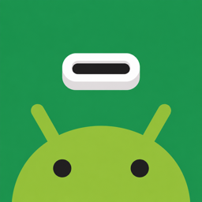
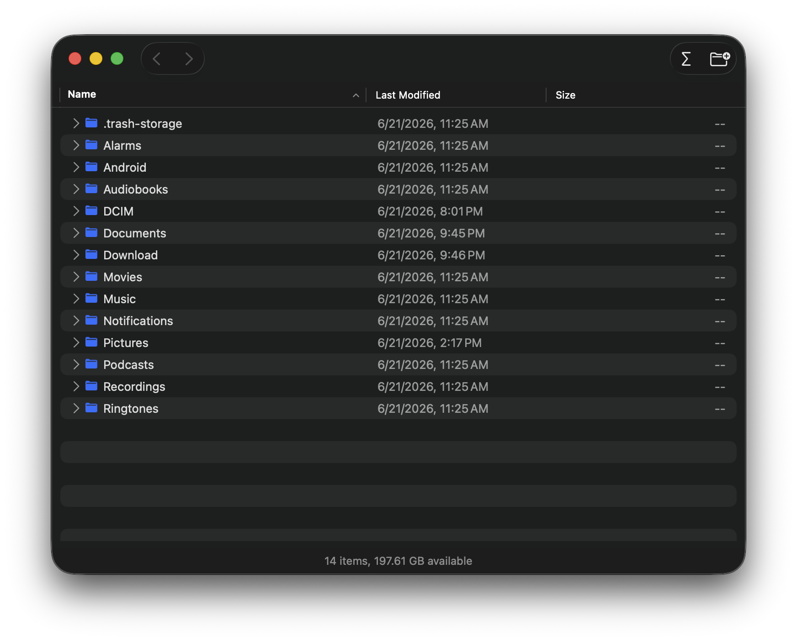

<div align="center">



# AFT — Android File Transfer

**A fast, native macOS app for browsing and transferring files to and from your Android phone over USB.**

Open source · Universal (Apple Silicon & Intel) · macOS 13+

</div>

---

AFT is a modern, no-friction replacement for Google's discontinued *Android File
Transfer*. macOS has no built-in support for MTP — the protocol Android uses to
expose its storage over USB — so AFT speaks it directly via `libmtp`/`libusb` and
presents your device in a clean, Finder-like window.

<div align="center">
  
</div>

## Features

- **Browse** your device in a familiar file list with **Name / Last Modified / Size** columns and inline disclosure triangles to expand folders in place.
- **Transfer both ways** — drag files and folders out to Finder, or drag them in to upload. Right-click → *Save to…* works too.
- **Manage files** — create folders, rename, and delete on the device.
- **Folder sizes on demand** — MTP doesn't report folder sizes, so AFT calculates them recursively when you ask (right-click → *Calculate Size*, or the ∑ toolbar button), with caching and cancellation.
- **Sortable columns**, multi-select, and a copy-progress sheet with time-remaining estimates.
- **Automatic device detection** — plug in and it connects; it even tells you when a phone is connected but still in charging-only mode.

## Requirements

- macOS 13 (Ventura) or later
- Apple Silicon or Intel (universal binary)
- An Android device set to **File Transfer / MTP** mode over USB

## Install

Download the latest `AFT.dmg` from the [Releases](../../releases) page, open it,
and drag **AFT** into your Applications folder.

> AFT is distributed outside the Mac App Store (MTP apps can't meet its
> sandboxing requirements). The current build is ad-hoc signed, so on first
> launch macOS Gatekeeper may warn you — right-click the app and choose **Open**.

## How it works

AFT is a SwiftUI app with a small Objective-C++ bridge to `libmtp`. All device
I/O runs on a background actor so the UI never blocks.

One macOS-specific detail: the system's `ptpcamerad` daemon grabs Android
devices the moment they connect, which blocks raw USB access. AFT briefly evicts
it to claim the device, then holds the connection. (This is why the app is not
sandboxed.)

## Building from source

```bash
# 1. Tools
brew install xcodegen pkg-config

# 2. Build the universal libmtp/libusb dependencies (arm64 + x86_64, macOS 13)
./scripts/build-universal-deps.sh
./scripts/vendor-dylibs.sh

# 3. Generate the Xcode project and build
xcodegen generate
open AFT.xcodeproj      # or: ./scripts/build.sh
```

Prebuilt universal dylibs are already vendored in `AFT/Frameworks/`, so steps in
(2) are only needed if you want to rebuild them yourself.

## License

AFT is released under the [MIT License](LICENSE).

It bundles `libmtp` and `libusb`, both under the GNU LGPL-2.1 — see
[THIRD-PARTY-LICENSES.md](THIRD-PARTY-LICENSES.md).

---

*Not affiliated with or endorsed by Google. "Android" is a trademark of Google LLC.*
